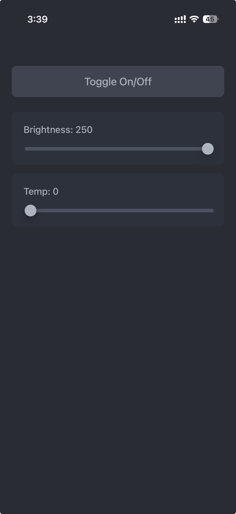

# Philips Hue BLE Light Controller

FastAPI web server for controlling Philips Hue lightbulb over Bluetooth Low Energy (BLE).

I created this because I refuse to sign the long ToS "updates" and "privacy policy" Philips was trying to force me to agree to in order to continue using my goddamn light bulb. And I much prefer this controller over the official Hue app because it's simple, unrestricted, and fully functional - turn on/off, change brightness, and change temperature.



## Setup

1. Install Python dependencies. If you use [uv](https://docs.astral.sh/uv/), run `uv sync`.
2. Take a look at the constants at the top of the controller/light_server.py file, they might not match your device and need to be customized (unless you have the same model Philips Hue bulb that I do). I personally used `bleak` to figure out the device name and bluetooth UUIDs for controlling my bulb. Before doing this you might need to factory reset the bulb and/or unpair it from your phone.
3. Run the server:
```bash
uv run uvicorn controller.light_server:app --reload --port 5007 --host 0.0.0.0
```
4. Access the controller at http://127.0.0.1:5007 or YOUR_IP:5007 on your local network. Works fine from a mobile device on your network too.
